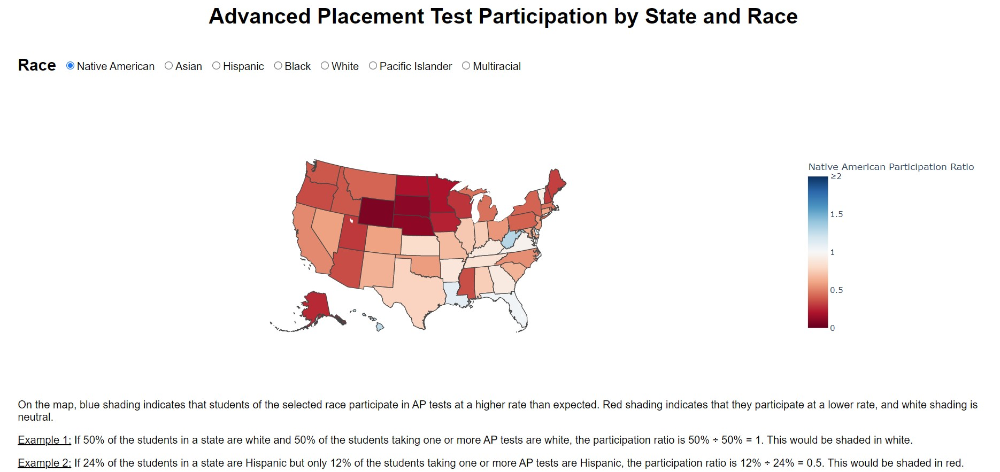
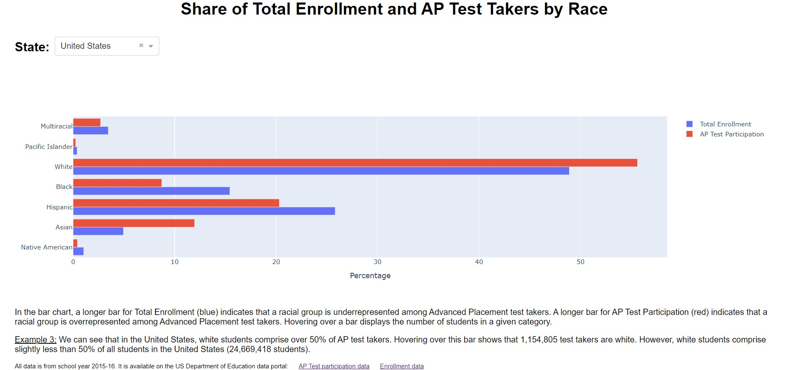
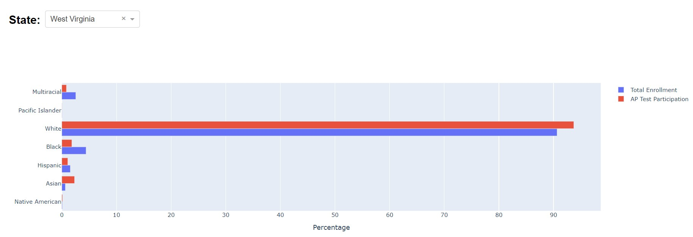

# The Questions
In the United States, Advanced Placement (AP) classes are an opportunity for secondary students to engage with college-level academic content. Typically, AP classes culminate in an AP test. If a student receives a passing score on an AP test, many colleges and universities will award course credit. So, AP tests provide an invaluable opportunity for students to earn college credit at a low cost and can reduce the number of classes they need to take to complete a college degree. In addition, they may expose to students to new subject areas and prepare them for rigorous future coursework.

Given the potential value of AP classes and testing, it is crucial to understand how accessible they are to students from different backgrounds. There are many, many dimensions to take into account, but one important consideration is race. Do students of different races have equal access to AP classes and tests? This investigation addresses the following questions:

**Question 1:** In terms of race, how does the population of AP test takers compare to the general student population?

**Question 2:** Are trends in test taker demographics consistent across states?

# The Data
To begin answering these questions, I accessed the most recent available data from the US Department of Education on AP test participation and overall enrollment.
  * [AP Test Participation Data](https://data.ed.gov/dataset/2015-16-advanced-placement-exam-taking-estimations) - students taking one or more Advanced Placement tests in 2016 by state and race.
  * [Enrollment Data](https://data.ed.gov/dataset/2015-16-estimations-for-enrollment) - total student enrollments for school year 2015-16 by state and race.

# Exploratory Data Analysis

Using this data, I constructed an interactive dashboard visualizing trends in AP test participation by race and by state. There are two components to the dashboard.

### 1. Color-Coded Map

The first element is a choropleth (data science lingo for color-coded map) showing if a selected race of students is underrepresented or overrepresented among AP test takers in each state. The color coding is based on what I am calling the *participation ratio*, illustrated in this example:

> Suppose a state has 1,000 students. The students are divided into three groups: 
> 400 in group A, 400 in group B, and 200 in group C.
> 
> Now say 100 of the students take an AP test. Based on the enrollment data, we would
> *expect* 40 students from group A, 40 from group B, and 20 from group C.
> Suppose the actual test takers are the expected 40 students from group A,
> a meager 20 from group B, and a hefty 40 from group C.
>
> |          | Group A | Group B | Group C|
> |:--------:|:-------:|:-------:|:------:|
> |Enrollment|  40%    |    40%  |   20%  |
> |Testing   |  40%    |    20%  |   40%  |
> |PR        |40÷40 = **1**|20÷40 = **0.5**|40÷20 = **2** |
>
> Clearly, group B is underrepresented and group C is overrepresented.
> The participation ratio (PR) quantifies the level of under- and over- representation
> by dividing a group's percentage of test takers by its percentage of enrollment.
> A participation ratio less than 1 signifies underrepresentation,
> equal to 1 signifies normal representation, and greater than 1 signifies overrepresentation.

Screenshot of the choropleth:

### 2. Bar Chart

The map enables quick state-to-state comparisons for a selected race, but it is unwieldy for comparing the representation of different races within a single state. Additionally, the participation ratio can obscure the actual sizes of populations: For instance, saying group A makes up 60% of test takers but only 30% of total student enrollment is a much more egregious example of overrepresentation than if group A makes up 6% of test takers but only 3% of total student enrollment. However, both scenarios produce an identical participation ratio (60÷30 = 6÷3 = **2**) are and indistinguishable on the map.

To fill in these gaps, the dashboard also includes a bar chart that displays each race's share of total student enrollment and AP test takers for a selected state. A glance at a state's bar chart immediately shows which groups are over- and under- represented, and hovering over each bar shows the exact numbers of students in each category.

Screenshot of the bar chart:

Access the full dashboard at <https://ap-test-participation-dashboard.azurewebsites.net/>

*The dashboard is currently hosted on a free version of Azure and takes a long time to load - be patient!*

### Initial Insights

Viewing the map with different races selected gives some immediate insights into our focus questions.

**Question 1:**
  * There's a lot of blue for white and Asian students -- they appear to be overrepresented among AP test takers in *every* state!
  * On the flip side, there's a lot of red for Hispanic and Black students. They appear to be underrepresented in *every* state.
  * Native American, Pacific Islander, and Multiracial students tend to be underrepresented, but there seem to be a few exceptions.
  * In general, trends in the AP test taker population reflect trends in standardized testing and other proxies for the achievement gap and opportunity gap.

**Question 2:**
  * As noted above, there are very clear trends that persist from state to state. BUT, there does seem to be a fair bit of variation state to state, especially when it comes to representation of Native American, Pacific Islander, and Multiracial students.

The also raises several follow-up questions. The most prominent for me was:

**Question 3:** Are there really states where Native American, Pacific Islander, and/or Multiracial students are overrepresented in a statistically significant way, or are the populations of these groups so small that the differences on the map merely reflect noise in small sample sizes?

# Significance Testing

To illustrate Question 3, consider Native American students in West Virginia. The map shades West Virginia a light blue and indicates a participation ratio of 1.29, meaning that there are about 30% more Native American AP test takers than one would expect given given their share of total student enrollment. Jumping down to the bar graph in the dashboard, one immediately becomes suspcious of the vanishingly small bars representing Native American students:

Reviewing the source data, Native American students account for 291 of the students in the state and 9 AP test takers. Nine test takers! That hardly seems statistically significant. Indeed, a chi-square test returns a p-value of 0.43, so the difference is not remotely statistically significant.

A battery of similar chi-square tests was run for all states that appeared on the choropleth as overrepresenting Native American, Pacific Islander, and/or Multiracial students ([view Jupyter Notebook here](https://github.com/ianmcmeek/AP-Test-Participation-Dashboard/blob/main/Supplemental/Significance_Tests.ipynb)). Of 19 tests that were run, only one returned a statistically significant result, and two returned marginally significant results.

|State               |Race            |Participation Ratio|p-value                       |
|:------------------:|:--------------:|:-----------------:|:----------------------------:|
|District of Columbia|Multiracial     |1.34               |0.003                         |
|South Carolina      |Pacific Islander|1.30               |0.061 (marginally significant)|
|Tennessee           |Pacific Islander|1.31               |0.094 (marginally significant)|

Although the p-value for the District of Columbia is statistically significant, the number of Multiracial AP test takers is still tiny: 96 (2.57% of test takers).

In a similar vein, chi-square tests were run for all states to see if the underrepresentation of Black and/or Hispanic students might not be statistically significant. For Hawaii, Idaho, and South Dakota, the underrepresentation of Black students is too small to be statistically significant. Notably, Black students account for less that 3% of student enrollment in each of these three states, so the sample size is quite small. In Alaska, the underrepresentation of Hispanic students (< 7% of all students) is too small to be statistically significant.

At this point, a surprise emerged -- although it was invisible on the map without zooming in, Hispanic students are overrepresented among AP test takers in the District of Columbia. Furthermore, the overrepresentation is statistically significant (p < 0.001)! An examination of the demographic profile reviewed that D.C. is definitely an outlier:
  * It has fewer students enrolled than any state
  * It has a smaller percentage of white students enrolled than any state
  * It has a higher percentage of Black students enrolled than any state by a large margin (~70% compared to <50% for all states)

These exceptional demographics presumably contribute D.C.'s unique status as the only location where Hispanic students are overrepresented among AP test takers.

A final set of tests was run to see if the overrepresentation of White and/or Asian students might not be statistically significant. It was found that the overrepresentation was statistically significant in every state.

# Conclusions and Future Directions

Equipped with our test results, the initial insights gleaned from the dashboard can be strenghtened.

**Question 1:**
  * White and Asian students are overrepresented among AP test takers. This is true in every state to an extent that is statistically significant.
  * All other races of students are underrepresented among AP test takers. This true in most states and is usually statistically significant (but see below for exceptions).

**Question 2:**
  * The underrepresentation of Black students in three states (Hawaii, Idaho, South Dakota) and Hispanic students in one state (Alaska) is not statistically significant.
  * In a number of states, the sample sizes of Native American, Pacific Islander, and Multiracial students are too small to draw reliable conclusions, even though at a national level there is significant underrepresentation.
  * The District of Columbia is the only location where a race other than White or Asian students is overrepresented among AP test takers. Both Multiracial and Hispanic students are overrepresented to a statistically significant extent. This may be attributable to the small number of students enrolled in D.C. and its distinguished racial profile.

The overarching theme of overrepresentation for White and Asian students at the expense of all other races is in with keeping trends throughout education in the United States. Still, it is shocking the extent to which the patterns of over- and under- representation persist from state to state. There is not a single state in which the racial profile of students taking Advanced Placement tests matches the racial profile of total student enrollment. More often than not, the difference between these racial profiles is quite large.

This analysis leaves many important questions unanswered and raises new questions. Some of these questions require additional investigation to better understand the current state of affairs, and some questions regard taking action and closing the gaps that were explored here.
  * Based on participation ratios, one might conclude that Asian students are more overrepresented than White students among AP test takers. **Is this true?**
> *I suspect it is, at least, less true than the participation ratios indicate. Consider West Virginia, where the Asian participation ratio is a whopping 3.62 and the white participation ratio is a modest 1.03. White students comprise over 90% of the total student enrollment in West Virginia, so their maximum possible participation ratio is less than 100÷90 = 1.11 if every AP test taker was white. Asian students comprise a much smaller portion of total student enrollment, making a much higher participation ratio possible. Additional metrics and tools beyond the participation ratio are needed to fairly determine if Asian students are more overrepresented than White students.*

  * While analyzing trends for different racial groups can provide valuable takeaways, it is a very coarse analysis and lumps diverse students together into a small number of categories. **What intra-group differences are obscured in this analysis?** For example, what if we had data not only on who checked the 'Asian' box on their test form, but also where in Asia those students' families are from and how many generations the families have been in the US?
  * **Which states are the closest to having their population of AP test takers reflect the demographics of their total student enrollment? What lessons can we learn from these states?**
  
  * Many barriers prevent minority groups from accessing the same educational opportunities as their White peers. **What barriers have the largest impact on who is taking AP tests?** (E.g. number of AP courses offered at a school vs. academic tracking vs. demographic profile of who is teaching AP classes)

  

Let me know comments and questions you have! Feel free to reach out on <a href=https://www.linkedin.com/in/ianmcmeeking/>LinkedIn</a>.

